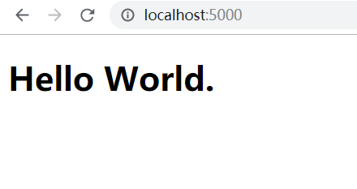

[TOC]

# 从零开始搭建Vue项目

## 初始化项目

创建项目的根目录，命名为`WithoutVueCli`。之后进入到目录中，执行`npm init -y`。

```bash
mkdir WithoutVueCli
cd WithoutVueCli
npm init -y
```

## 安装依赖

先分析下我们需要安装哪些依赖吧。

构建项目使用Webapck；JavaScript的代码处理使用Babel；SCSS样式使用sass-loader，再配上Autoprefixer；

### webpack系列

项目使用`webpack`工具进行打包，需要安装`webpack`、`webpack-cli`、`webpack-dev-server`这三个依赖。

同时，因为开发配置与生成配置是两个独立的文件，需要`webpack-merge`合并最基础的配置。

```bash
npm i -D webpack webpack-cli webpack-dev-server webpack-merge
```

### Babel系列

我们需要安装babel的依赖，来处理ES5版本以上的JS代码。

```bash
npm i -D bable-loader @babel/core @babel/preset-env @babel/plugin-transform-runtime 
npm i -S @babel/runtime
```

### Vue系列

既然是Vue的项目，自然需要安装Vue的相关包依赖，执行下面的命令安装：

```bash
npm i -S vue
npm i -D vue-loader vue-template-compiler vue-router
```

### CSS系列

项目采用的是`SCSS`预处理器，如果要安装其他的预处理器，可自行Google。

```bash
npm i -D sass-loader node-sass style-loader css-loader
```

### 图片和字体

需要安装两个依赖：`url-loader`、`file-loader`。

```bash
npm i -D url-loader file-loader
```

### html-webpack-plugin

安装`html-webpack-plugin`插件，这个插件会自动生成html文件，当然，也可以指定模版生成。

```bash
npm i -D html-webpack-plugin
```

## 编写Webpack与相关配置

在项目的根目录下，我们创建一个`webpack.config.js`文件，并在对其编写如下：

```javascript
//webpack.config.js
const VueLoaderPlugin = require('vue-loader/lib/plugin')
const path = require('path')
const HtmlWebpackPlugin = require('html-webpack-plugin')


module.exports = {
  entry: './src/main.js',
  output: {
    path: path.resolve(__dirname, './build/'),
    filename: 'scripts/bundle.js',
    publicPath: '/'
  },
  resolve: {
    extensions: ['.vue', '.js']
  },
  module: {
    rules: [
      {
        test: /\.js$/,
        exclude: /node_modules/,
        use: 'babel-loader'
      },
      {
        test: /\.vue$/,
        use: 'vue-loader'
      }
    ]
  },
  devServer: {
    host: 'localhost',
    port: 5000,
    histortyApiFallback: true
  },
  plugins: [
    new VueLoaderPlugin(),
    new HtmlWebpackPlugin({
      filename: 'index.html',
      template: path.resolve(__dirname, './src/main.js')
    })
  ]
}
```

这是基本的webpack配置。我们使用到`babel-loader`来转译JS，按照其官方要求，我们还需要对babel编写配置，编写配置有几种，这里采用其中一种，感兴趣的同学可以去官网查看。

在根目录下，我们创建`babel.config.js`文件，并对其编写配置：

```javascript
//babel.config.js
module.exports = {
  presets: [
    [
      '@babel/preset-env',
      {
        useBuiltIns: 'usage'
      }
    ]
  ],
  plugins: ['@babel/plugin-transform-runtime']
}
```

## 创建src目录

在根目录下创建`src`目录，然后依次在该目录下创建`main.js`、`App.vue`、`index.html`。创建完成后，就可以编写代码了。

**main.js**

```javascript
//main.js
import Vue from 'vue'

import App from './App'

new Vue({
  render: h => h(App)
}).$mount('#root')
```

**App.vue**

```vue
//App.vue
<template>
  <div>
    <h1>{{msg}}</h1>
  </div>
</template>

<script>
  export default {
    name: 'App',
    data() {
      return {
        msg: '不使用Vue-CLI来搭建Vue项目'
      }
    }
  }
</script>

<style scoped>
</style>
```

**index.html**

```html
<!doctype html>
<html lang="zh-CN">
<head>
  <meta charset="UTF-8">
  <meta name="viewport" content="width=device-width, initial-scale=1.0">
  <meta http-equiv="X-UA-Compatible" content="ie=edge">
  <title>Without Vue-CLI to build project</title>
</head>
<body>
  <div id="root"></div>
</body>
</html>
```

## 编写命令

打开`package.json`文件，我们编写执行打包的命令。

```json
{
  "script": {
    "start": "webpack-dev-server --config ./webpack.config.js",
    "build": "webpack --config ./webpack.config.js"
  }
}
```

执行`npm start`，编译成功之后，打开浏览器输入`localhost:5000`，页面中会展示`App.vue`中的内容。



之后我们执行`npm run build`，看是否能构建成功。如果构建成功，会在根目录下生成一个`build`目录，里面就是我们打包的文件。

打包的项目是需要在服务器环境下运行，检测项目是否可以运行，我们可以安装一个工具来运行这个项目。

```bash
npm i -g http-server
cd build
http-server
```

全局安装 `http-server`依赖，然后进入到`build`目录，执行`http-server`。

之后会出现一段信息如下：

```bash
Starting up http-server, serving ./
Available on:
  http://192.168.1.5:8080
  http://127.0.0.1:8080
Hit CTRL-C to stop the server
```

我们按照提示打开`127.0.0.1:8080/index.html`，一样显示我们填写的内容的话，就说明谋稳台（粤语乱入）啊。

## 独立webpack的配置

在实际工作中，我们的项目一般来说不会只有一个`webpack.config.js`，一般会分成三个文件：

1. `webpack.base.js`是基本的webpack配置
2. `webpack.dev.js`是开发模式下的配置
3. `webpack.prod.js`是生产模式下的配置

这三个文件分别放置在独立的目录中，有的项目会把配置文件放在`config`目录中，有的则会放在`build`目录中，本项目采取前者。

在项目根目录下，创建`config`目录，将`webpack.config.js`移到该目录中。然后创建`webpack.prod.js`、`webpack.dev.js`两个文件。

我们先重命名`webpack.config.js`为`webpack.base.js`，然后更改配置：

```javascript
//webpack.base.js
const VueLoaderPlugin = require('vue-loader/lib/plugin')
const path = require('path')
const HtmlWebpackPlugin = require('html-webpack-plugin')

module.exports = {
  entry: '../src/main.js',
  resolve: {
    alias: {
      '@': path.resolve(__dirname, '../src/')
    },
    extensions: ['.vue', '.js']
  },
  module: {
    rules: [
      {
        test: /\.js$/,
        exclude: /node_modules/,
        use: 'babel-loader'
      },
      {
        test: /\.vue$/,
        use: 'vue-loader'
      }
    ]
  },
  plugins: [
    new VueLoaderPlugin(),
    new HtmlWebpackPlugin({
      filename: 'index.html',
      template: path.resolve(__dirname, '../src/index.html'),
      title: 'Without Vue Cli to build project.'
    })
  ]
}
```

我们把`output`剪切到`webpack.prod.js`，把`devServer`剪切到`webpack.dev.js`。

**webpack.dev.js**

```javascript
//webpack.dev.js
const merge = require('webpack-merge')
const baseConfig = require('./webpack.base')

module.exports = merge(baseConfig, {
  mode: 'development',
  devtool: 'cheap-module-eval-source-map',
  devServer: {
    host: 'localhost',
    port: 5000,
    historyApiFallback: true
  },
  module: {
    rules: [
      {
        test: /\.scss$/,
        use: ['style-loader', 'css-loader', 'sass-loader']
      }
    ]
  }
})
```

***webpack.prod.js**

```javascript
const merge = require('webpack-merge')
const path = require('path')
const baseConfig = require('./webpack.base')
const MiniCssExtractPlugin = require('mini-css-extract-plugin')
const CleanWebpackPlugin = require('clean-webpack-plugin').CleanWebpackPlugin

module.exports = merge(baseConfig, {
  mode: 'production',
  devtool: 'cheap-module-source-map',
  output: {
    path: path.resolve(__dirname, '../build/'),
    filename: 'scripts/bundle.js',
    publicPath: '/'
  },
  module: {
    rules: [
      {
        test: /\.scss$/,
        use: [
          MiniCssExtractPlugin.loader,  //生成模式分离css为单独文件
          'css-loader',
          'sass-loader'
        ]
      }
    ]
  },
  plugins: [
    new CleanWebpackPlugin()  //每次构建时先清除已生成的目录，这里指output配置的目录
  ]
})
```

至此，我们还需要修改`package.json`的脚本命令：

```json
{
  "script": {
    "start": "webpack-dev-server --config ./config/webpack.dev.js",
    "dev": "webpack --config ./config/webpack.prod.js"
  }
}
```

接下来，我们还要做一些工作。在`src`目录下分别创建`views`、`assets`目录，`assets`目录下还创建一个`styles`目录，里面创建一个`global.scss`的样式文件。`views`目录中，创建一个`Home.vue`的文件。

接下来，编写`global.scss`文件：

```scss
@charset "UTF-8";

*, *:after, *:before {
  box-sizing: border-box;
}

html, body {
  margin: 0;
  padding: 0;
}
```

编写`Home.vue`文件：

```vue
<template>
  <div class="container">
    <header>
      <h1>{{msg}}</h1>
    </header>
  </div>
</template>

<script>
  export default {
    name: 'Home',
    data() {
      return {
        msg: '这是首页'
      }
    }
  }
</script>

<style scoped lang="scss">
h1 {
  margin: 0;
  text-align: center;
}
</style>
```

之后我们在`App.vue`的文件中引入`Home.vue`组件。

```vue
<template>
  <div id="app">
    <Home></Home>
  </div>
</template>

<script>
import Home from './views/Home'

export default {
  name: 'App',
  data() {
    return {}
  },
  components: {
    Home
  }
}
</script>

<style scoped lang="scss">
#app {
  background: #eeeeee;
  color: cadetblue;
}
</style>
```

在`main.js`中引入`global.scss`样式。

```js
import Vue from 'vue'

import App from './App'
import '@/assets/styles/global.scss'

new Vue({
  render: h => h(App)
}).$mount('#root')
```

至此我们运行`npm start`启动项目，打开指定的host和端口，查看项目：


开发模式下成功构建！我们来查看生产模式有没有问题，执行命令`npm run build`构建。

