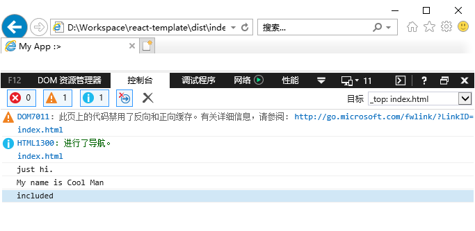
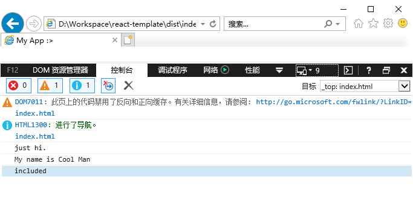

# 从零开始搭建React、Vue项目

## 简要

本文默认读者熟悉ES6，熟悉`npm`和`git`的操作，以及熟悉React或者Vue的使用。如果你是老鸟可以关闭这个标签页了（手动狗头），当然，欢迎大家提出建议，如有错误的地方，也欢迎指正。

## 创建项目目录

使用命令行创建或者手动创建目录。在目录中执行npm初始化操作。

```bash
mkdir react-template && cd react-template
npm init -y
```

## 初始化版本控制系统Git

做这一步之前，需要电脑安装Git，如果还没有安装，可到[官网](https://git-scm.com/download)下载安装包。

```bash
git init
```

## 安装Webpack

我们给项目本地添加webpack的依赖，在命令行中输入：

```bash
npm i -D webpack webpack-cli webpack-dev-server
```

- `webpack`：webpack的核心依赖包。
- `webpack-cli`：在webpack 4中，webpack的命令行功能已被单独分离到这里。
- `webpack-dev-server`：在项目开发时所需的本地server依赖包。

安装完`webpack`依赖之后，我们创建`webpack`的配置文件`webpack.config.js`，然后写些简单的配置：

```javascript
const path = require('path')

module.exports = {
  output: {
    path: path.resolve(__dirname, './dist'), // path 文件输出的路径，必须是绝对路径
    filename: 'bundle.js' // filename 对应entry而生成的文件名
  },
  module: {
    rules: [
      {
        test: /\.js$/,  // 凡是以js后缀结尾的文件
        use: 'babel-loader'  // 给它用babel-loader转译
      }
    ]
  }
}
```

## 安装babel

项目需要使用Babel工具来对JS代码进行转换，因此我们需要安装Babel的相关依赖：

```bash
npm i -D @babel/core @babel/preset-env @babel/preset-react @babel/plugin-transform-runtime babel-loader

npm i @babel/runtime-corejs3
```

- `@babel/core`：如其名，这是babel的核心代码包。
- `@babel/preset-env`：`env`依赖包支持把ES6+也就是已经形成标准的而不是提案的JS特性转换成ES5。
- `@babel/preset-react`：这是用于转换JSX语法的，适用于react项目。这个项目包含了`@babel/plugin-syntax-jsx`、`@babel/plugin-transform-react-jsx`、`@babel/plugin-transform-react-display-name`这三个依赖包。
- `@babel/plugin-transform-runtime`：一个让Babel反复注入`helper code`即辅助代码，来帮助减小代码大小。
- `babel-loader`：webpack中Babel的loader，来使用Babel。
- `@babel/runtime-corejs3`：包含`core-js@3`和`regenerator-runtime`，属于辅助程序，是`@babel/plugin-transform-runtime`一起作为运行时的依赖。`core-js@3`用作pollyfill，并且支持ES6+的新特性，`regenerator-runtime`用于重新生成程序编译的生成器和异步函数的独立运行时，FB家的。

安装完依赖之后，我们在项目根目录创建一个`babel.config.json`的文件，这是babel转译代码所需的配置文件，我们填写如下配置：

```json
{
  "plugins": [
    ["@babel/plugin-transform-runtime", {
      "corejs": 3
    }]
  ],
  "presets": ["@babel/preset-env", "@babel/preset-react"]
}
```

> `presets`预设，执行顺序是**从右至左**；`plugins`插件，在预设之前运行，自身执行顺序是**从左至右**。

现在，来测试一下我们目前为止所做的是否正确，创建`src`目录，并在该目录下创建`index.js`，在里面写一些代码来测试一下：

```javascript
const greeting = 'just hi.'

const [methodSayHi, methodSayName] = ['sayHi', 'sayName']
class Person {
  constructor() {
    this.name = 'Cool Man'
  }

  [methodSayHi]() {
    console.log(`${greeting}`)
  }

  [methodSayName]() {
    console.log(`My name is ${this.name}`)
  }
}

const man = new Person()
man.sayHi()
man[methodSayName]()

const arr = [1, 2, 3]
const promise = new Promise((resolve, reject) => {
  setTimeout(() => {
    if (arr.includes(2)) {
      resolve('included')
    } else {
      reject('not included')
    }
  }, 1000)
})

const asyncFunc = async function() {
  const answer = await promise.then(res => res, err => err)
  console.log(answer)
}
asyncFunc()
```

在根目录下找到`package.json`，打开并找到`scripts`中的`test`命令，将其改写为如下代码：

```json
"scripts": {
  "start": "webpack"
}
```

在命令行中执行：
```bash
npm start
```

然后就会执行`package.json`中的`start`命令，而`start`命令又执行`webpack`让其按照`webpack.config.js`中的配置工作。一切执行完之后，根目录下多了一个`dist`的文件夹，里面有一个`bundle.js`的文件，而这，就是我们在`webpack.config.js`中做的配置输出。

> 大家都知道`webpack`有个很关键的`entry`入口配置，为什么没有写呢？原因是`entry`有默认值的，即`src/index.js`，后面多入口页会写到。

## 安装html-webpack-plugin

```bash
npm i -D html-webpack-plugin
```

这是一个会自动创建`html`文件的插件，还会帮你自动引入打包好的资源，它无需任何配置即可运作。
回到`webpack.config.js`这个文件，我们引入`html-webpack-plugin`插件，并配置它：

```javascript
const HtmlWebpackPlugin = require('html-webpack-plugin')

module.exports = {
  output: { /* 省略部分代码... */ },
  module: { /* 省略部分代码... */ },
  plugins: {
    new HtmlWebpackPlugin({
      title: 'My App :>'
    })
  }
}
```

在命令行中执行`npm start`执行打包任务，完成之后`dist`目录会多出一个`index.html`的文件，我们双击它在浏览器中打开，你会发现标签页的标题是**My App :>**，我们再按下`F12`打开控制台，在`console`那查看我们js的输出，如果你看不到任何内容需要刷新一下才会再次出现。


在Chrome浏览器中显示正常，那么去IE看看：

- **IE 11**



- **IE 10**


- **IE 9**



什么，你问IE8？How dare you!（某环保少女腔调(ﾟДﾟ*)ﾉ）

尝试着拿这个[数据](https://caniuse.com/usage-table)去说服老板或者产品不要用IE8了。

